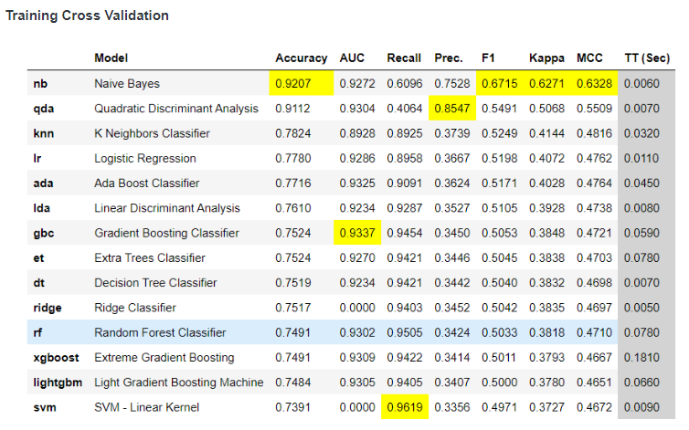
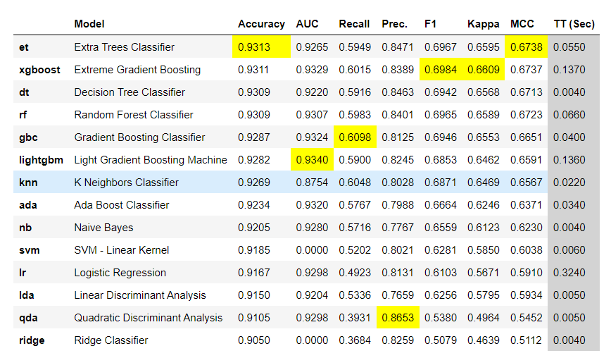

# Tide Receipt Matching

For each *feature_transaction_id*, by defining the response variable *is_match* as:

            is_match = 1 if matched_transaction_id = feature_transaction_id
                       0 otherwise
The problem has been converted into a supervised learning binary classification problem. Moreover, since the class distribution of our reponse variable *is_match* is highly skewed, the problem falls under the class of an imbalanced binary classification problem. 

This repository contains 4 notebooks and should be explored in the following order:
1) [Data Cleaning.ipynb](https://github.com/Sid-darthvader/Tide_Receipt_Matching/blob/main/Data%20Cleaning.ipynb)
2) [Data Analysis.ipynb](https://github.com/Sid-darthvader/Tide_Receipt_Matching/blob/main/Data%20Analysis.ipynb)
3) [Model Exploration.ipynb](https://github.com/Sid-darthvader/Tide_Receipt_Matching/blob/main/Model%20Exploration.ipynb)
4) [Finalizing Model & Generating Predictions.ipynb](https://github.com/Sid-darthvader/Tide_Receipt_Matching/blob/main/Finalizing%20Model%20%26%20Generating%20Predictions.ipynb)

Do make sure that you install all dependencies mentioned in [requirements.txt](https://github.com/Sid-darthvader/Tide_Receipt_Matching/blob/main/requirements.txt)

## [Data Cleaning](https://github.com/Sid-darthvader/Tide_Receipt_Matching/blob/main/Data%20Cleaning.ipynb)
The original dataset had a large imbalance amongst the 2 classes (Match v/s Non-Match transactions). This would have led to sub-par performance of ML models in identifying the correct matching transaction for a given receipt id.

Class imbalance was improved by ~5 percentage points by dropping the entries corresponding to receipt_ids which had no match amongst all the available transactions. 

Head over to the [Data Cleaning](https://github.com/Sid-darthvader/Tide_Receipt_Matching/blob/main/Data%20Cleaning.ipynb) notebook for more details.

## [Data Analysis](https://github.com/Sid-darthvader/Tide_Receipt_Matching/blob/main/Data%20Analysis.ipynb)
The plot below depicts the distribution of the total number of transaction matches possible for a given receipt.

It tells us that the most common possibility is 5 potential transaction matches for a scanned receipt.

Further, we can see how other features of the matching vector are distributed

Due to the heavyily imbalanced classes almost all features--except *DateMappingMatch* & *AmountMappingMatch*-- are predominantly populated with 0s.

Things get slightly better and we have marginally better distributed featuress once we restrict the data to only the matched entries. However, the distribution is still very skewed which makes it extremely challenging to build good classification models and accurately determine the correct transaction match.

We also find that except for the matching features *AmountMappingMatch* & *PredictedAmountMatch*, almost all other features seem to have a good enough correlation with the target variable.

For more details, explore the [Data Analysis notebook](https://github.com/Sid-darthvader/Tide_Receipt_Matching/blob/main/Data%20Analysis.ipynb).

## [Model Exploration](https://github.com/Sid-darthvader/Tide_Receipt_Matching/blob/main/Model%20Exploration.ipynb)
We test the performance of ~15 different ML classifiers using 10-fold cross-validation on:

### 1) Dataset balanced using synthetic data- [SMOTE](https://arxiv.org/pdf/1106.1813)

### 2) Original Dataset

#### Note: 
Using pycaret, several pre-processing techniques (such as adding interaction terms to the existing features and/or normalizing the data) were experimented, however none of them seemed to offer better accuracies than what are given above.

It might be tempting to see the high accuracy and quickly declare the model as a good one, alas things are not so simple for Imbalanced Classification problems. From the bunch of classification metrics available, we use **precision-recall** over **AUC score** and standard accuracy score (since its more advisable to do so for imbalanced classes). The **F1 score** is calculated as the geometric mean of precision and recall and we choose it as our primary metric to shortlist models!

#### Note: 
- **Precision:**  Out of all the predicted transaction matches, how many were predicted correctly by the model?
- **Recall:** Out of all the transactions, how many matches were correctly identified by the model?

Furthermore, we would try to have a higher recall(sensitivity) since we are interested in identifying more matches.

So as we can see, balancing the dataset using synthetic data does not lead to good results. While xgboost is able to obtain a really high recall, unfortunately it comes at the cost of precision. 
On the other hand, the original dataset seems to offer a more balanced precision-recall score.

We proceed with the imbalanced dataset('df_cleaned.csv') for all further tasks.

### Shortlisted Models
Based on the 10-fold CV results and some other conditions (details in the Modeling notebook), we shortlist the following 3 models and tune their hyperparameters using randomized grid search and finally evaluate their performance on a holdout set:

### 1) XGBoost

### 2) RandomForest

### 3) NaiveBayes

### 4) Soft Voting Ensemble Classifier
The model blends together the probabities returned by XGBoost, RandomForest and NaiveBayes.

Since the tuned XGBoost model seems to be performing the best amongst all the models based on the criteria that we defined earlier, we choose it as our final model.

## [Finalizing Model & Generating Predictions](https://github.com/Sid-darthvader/Tide_Receipt_Matching/blob/main/Finalizing%20Model%20%26%20Generating%20Predictions.ipynb)

### Evaluating the trained models' performance

We generate a bunch of different evaluation plots for our tuned XGBoost classifier.

**For the end user, having a recall of 0.615 for the positive class on the holdout set means that our tuned XGBoost classifer is able to identify 61.5% of the correct matches when used in the real world. Similarly a recall of 0.977 for the negative class means that it is able to correctly identify 97.7% of the non-match transactions.**

**On the other hand, having a precision of 0.799 for the the positive class on the holdout set means that out of all matches predicted by our tuned XGBoost classifer ~80% of them are correct. Similarly a precision of 0.944 for the negative class means that out of all the non-matches identified, 94.4% of them are correct.**

**CAVEAT: An AUC score of 0.93 signifies that our model is able to differentiate between the two classes quite well. However, the AUC score is only meaningful if the class-distribution is balanced. Hence, it would not be an ideal metric to consider for our problem!**

Furthermore, we also calculate feature importance and find that *DateMappingMatch* , *ShortNameMatch=1*, *TimeMappingMatch=1*, *Different_Predicted_Match=1* & *DescriptionMatch* seem to be the most important factors that help in differentiating potential matches from non-matches.

### Generating predictions on new data

We create a new function (***order_by_likelihood_of_match()***) that can be used to order a set of transactions for a given receipt_id according to their likelihood of match.

For details on how this function works and how to use it with new data please refer to the documentaion provided in the [associated notebook](https://github.com/Sid-darthvader/Tide_Receipt_Matching/blob/main/Finalizing%20Model%20%26%20Generating%20Predictions.ipynb).

As a pilot run of our newly created function, we calculate the likelihood of matches from our trained model on corrusponding to the receipt_id = "10,001" (the first entry in our dataset).
For this entry, we already know that the correct match corresponds to feature_id = "10,605".

Our model assigns equal likelihood to feature_ids: "10,005" & "10,006" which is not ideal but very close to the ground truth given the huge imbalance in the trained dataset!

## Recommendations to the team

As seen during Data Analysis, even for the matching entries, the feature values of the matching vector are predominantly 0s. 
Due to this even complex ML models are unable to identify the correct match for a given receipt.
Perhaps it would be best to re-visit how the values in these matching vectors are being created and see if we can re-define them to reduce the skewness of the feature values towards 0.

Using techniques of [causal discovery](https://arxiv.org/pdf/2103.02582) it would also be interesting to see which features have a causal impact (versus a simple correlational match) on the transaction being a match. Using causal drivers as features in our predictive models might help us achieve a better precision-recall balance!
