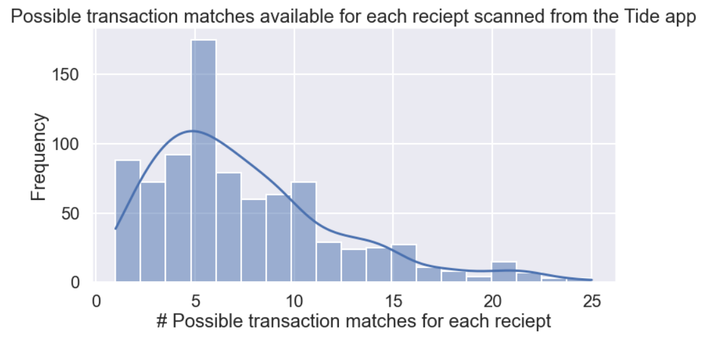
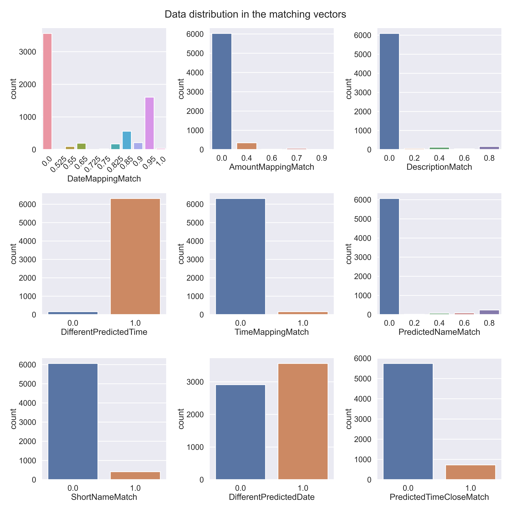
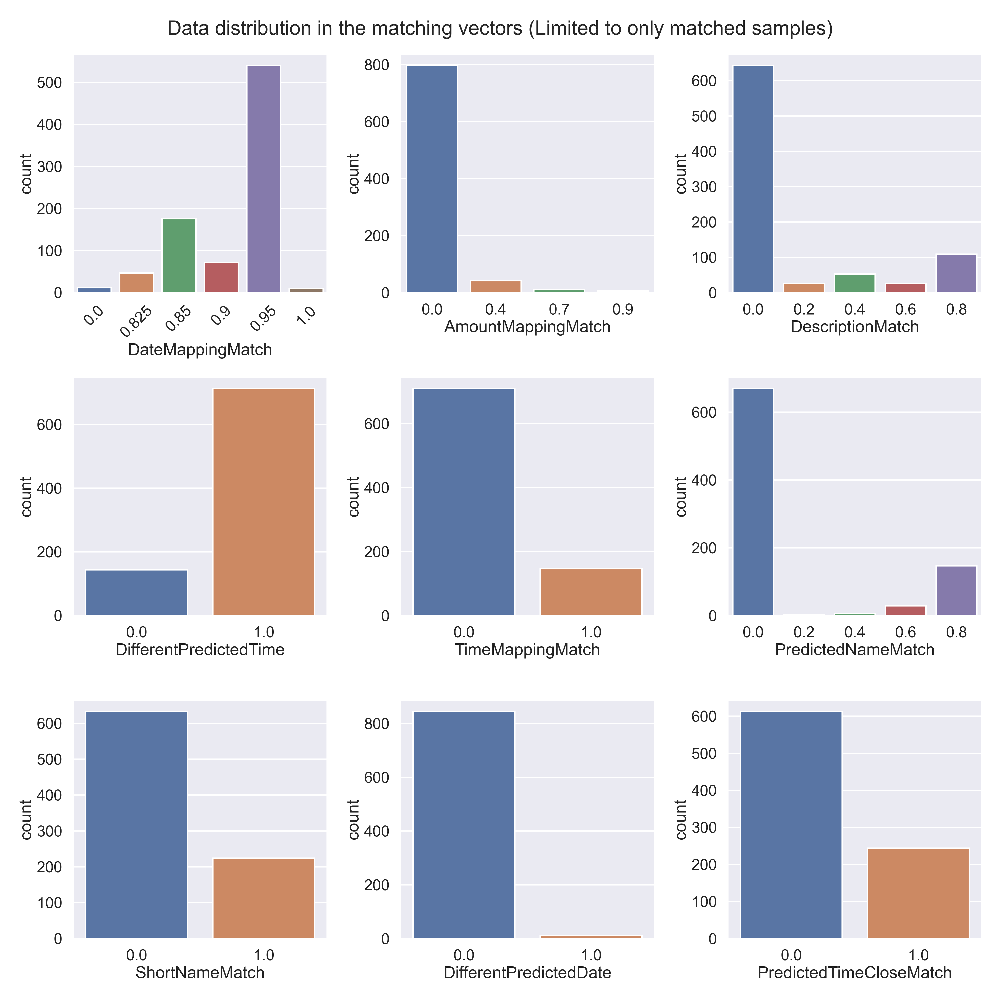

# Tide Receipt Matching

The problem falls into the category of imblanced binary classification.

This repository contains 4 notebooks and should be explored in the following order:
1) [Data Cleaning.ipynb](https://github.com/Sid-darthvader/Tide_Receipt_Matching/blob/main/Data%20Cleaning.ipynb)
2) [Data Analysis.ipynb](https://github.com/Sid-darthvader/Tide_Receipt_Matching/blob/main/Data%20Analysis.ipynb)
3) [Model Exploration.ipynb](https://github.com/Sid-darthvader/Tide_Receipt_Matching/blob/main/Model%20Exploration.ipynb)
4) [Finalizing Model & Generating Predictions.ipynb](https://github.com/Sid-darthvader/Tide_Receipt_Matching/blob/main/Finalizing%20Model%20%26%20Generating%20Predictions.ipynb)

## [Data Cleaning](https://github.com/Sid-darthvader/Tide_Receipt_Matching/blob/main/Data%20Cleaning.ipynb)
The original dataset had a large imbalance amongst the 2 classes (Match v/s Non-Match transactions). This would have led to sub-par performance of ML models in identifying the correct matching transaction for a given receipt id.

Class imbalance was improved by ~5 percentage points by dropping the entries corresponding to receipt_ids which had no match amongst all the available transactions. 

Head over to the [Data Cleaning](https://github.com/Sid-darthvader/Tide_Receipt_Matching/blob/main/Data%20Cleaning.ipynb) notebook for more details.

## [Data Analysis](https://github.com/Sid-darthvader/Tide_Receipt_Matching/blob/main/Data%20Analysis.ipynb)
The plot below depicts the distribution of the total number of transaction matches possible for a given receipt.

It tells us that the most common possibility is 5 potential transaction matches for a scanned receipt.

Further, we can see how other features of the matching vector are distributed

Due to the heavyily imbalanced classes almost all features--except *DateMappingMatch* & *AmountMappingMatch*-- are predominantly populated with 0s.

Things get slightly better and we have marginally better distributed featuress once we restrict the data to only the matched entries. However, the distribution is still very skewed which makes it extremely challenging to build good classification models and accurately determine the correct transaction match.

For more details, explore the [Data Analysis notebook](https://github.com/Sid-darthvader/Tide_Receipt_Matching/blob/main/Data%20Analysis.ipynb).

