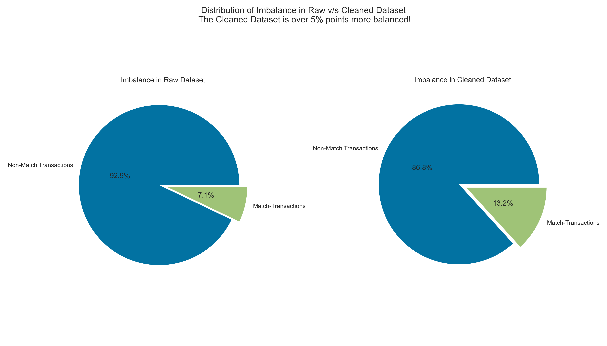

# Tide Receipt Matching

This repository contains 4 notebooks and should be explored in the following order:
1) [Data Cleaning.ipynb](https://github.com/Sid-darthvader/Tide_Receipt_Matching/blob/main/Data%20Cleaning.ipynb)
2) [Data Analysis.ipynb](https://github.com/Sid-darthvader/Tide_Receipt_Matching/blob/main/Data%20Analysis.ipynb)
3) [Model Exploration.ipynb](https://github.com/Sid-darthvader/Tide_Receipt_Matching/blob/main/Model%20Exploration.ipynb)
4) [Finalizing Model & Generating Predictions.ipynb](https://github.com/Sid-darthvader/Tide_Receipt_Matching/blob/main/Finalizing%20Model%20%26%20Generating%20Predictions.ipynb)

## Data Cleaning
The original dataset had a large imbalance amongst the 2 classes (Match v/s Non-Match transactions). This would have led to sub-par performance of ML models in identifying the correct matching transaction for a given receipt id.

Class imbalance was improved by ~5 percentage points by dropping the entries corresponding to receipt_ids which had no match amongst all the available transactions. 

Head over to the [Data Cleaning](https://github.com/Sid-darthvader/Tide_Receipt_Matching/blob/main/Data%20Cleaning.ipynb) notebook for more details.

## Data Analysis
